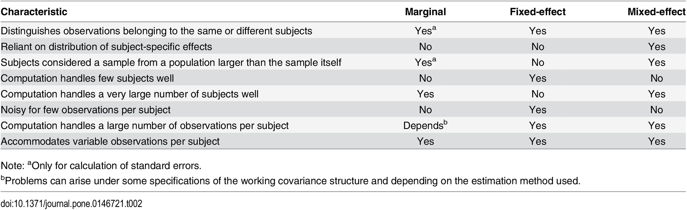

# Learning objectives and outline

## Learning objectives

1. Define mixed effects models and population average models
2. Perform model diagnostics for random effects models
3. Interpret random intercepts and random slopes
4. Define and perform population average models
5. Define assumptions on correlation structure in hierarchical models
5. Choose between hierarchical modeling strategies

## Outline

1. Review of fecal fat dataset
2. Summary of non-hierarchical approaches
2. Mixed effects models
3. Longitudinal data and the Georgia Birthweights dataset
4. Population average models and Generalized Estimating Equations (GEE)

* Vittinghoff sections 7.2, 7.3, 7.5

# Review

## Fecal fat dataset

* Lack of digestive enzymes in the intestine can cause bowel absorption problems.
     - This will be indicated by excess fat in the feces. 
     - Pancreatic enzyme supplements can alleviate the problem.
     - fecfat.csv: a study of fecal fat quantity (g/day) for individuals given each of a placebo and 3 types of pills
     


```{r readdata, echo=FALSE, message=FALSE}
suppressPackageStartupMessages({
  library(tidyverse)
  library(ggplot2)
  library(gridExtra)
})
dat <- read.csv("fecfat.csv") %>%
  mutate(pilltype = factor(pilltype, levels = c("none", "tablet", "capsule", "coated"))) %>%
  mutate(subject = factor(subject))
```

## Fecal fat dataset

```{r boxplot, echo=FALSE}
p1 <- ggplot(dat, aes(pilltype, fecfat)) +
  geom_boxplot(outlier.shape = NA) +
  geom_jitter(width = 0.2, aes(size = 1.5), alpha = 0.5) +
  theme_grey(base_size = 22) +
  theme(legend.position = "none") +
  theme(axis.text.x = element_text(
    angle = 45,
    vjust = 1,
    hjust = 1
  )) +
  xlab("Treatment") + ylab("Fecal Fat (mg/day)")
p2 <-
  ggplot(dat, aes(
    x = pilltype,
    y = fecfat,
    group = subject,
    lty = subject
  )) +
  geom_line(size = 1) +
  theme_grey(base_size = 22) +
  theme(legend.position = "none") +
  theme(axis.text.x = element_text(
    angle = 45,
    vjust = 1,
    hjust = 1
  )) +
  xlab("Treatment") + ylab("Fecal Fat (mg/day)")
library(gridExtra)
grid.arrange(p1, p2, ncol = 2)
```

## Analysis strategies for hierarchical data

* Fixed effects and other non-hierarchical strategies
* Random / mixed effects models
    - model certain regression coefficients (intercept, slopes) as random variables
* Population average models
    - using Generalized Estimating Equations (GEE)

# Non-hierarchical analysis strategies 

## Non-hierarchical analysis strategies for hierarchical data

* Analyses for each subgroup
    - e.g., look at each patient independently
    - doesn't work at all in this example, and in general is not an integrated analysis of the whole data
    - could sort of work for an example with many patients per doctor, a few doctors
    
* Analysis at the highest level in the hierarchy
    - first summarize data to highest level
    - doesn't work at all in this example
    - could sort of work for an example with few patients per doctor, many doctors

* Analysis on "Derived Variables"
    - consider each treatment type separately, take differences in fat levels between treatment/control for each patient and use paired t-tests
    - can work, but not for unbalanced groups

* Fixed-effects models


## When is hierarchical analysis definitely needed?

1. the correlation structure is of interest, _e.g._ familial aggregation of disease, or consistency of treatment within centers
2. we wish to “borrow strength” across the levels of a hierarchy in order to improve estimates
3. dealing with unbalanced data
4. we want to benefit from software designed for hierarchical data

# Mixed effects models

## Mixed effects models

* Model looks like two-way ANOVA:
$$
FECFAT_{ij} = \beta_0 + \beta_{subject i} SUBJECT_i + \beta_{pilltype j} PILLTYPE_j + \epsilon_{ij}
$$
     - Assumption: $\epsilon_i \stackrel{iid}{\sim} N(0, \sigma_\epsilon^2)$

* But instead of fitting a $\beta$ to each individual, we assume that the subject effects are selected from a distribution of possible subject effects:
$$
FECFAT_{ij} = \beta_0 + SUBJECT_i + \beta_{pilltype j} PILLTYPE_j + \epsilon_{ij}
$$

Where we assume: $SUBJECT_i \stackrel{iid}{\sim} N(0, \tau_{00}^2)$

* This is a *mixed effects* model because:
    - the "true" intercept varies randomly from patient to patient
    - the "true" (population) coefficient of treatment is fixed (the same for everyone)

## Fit this mixed-effects model

```{r, message=FALSE}
library(nlme)
fitmix <- nlme::lme(fecfat ~ pilltype, 
                    data = dat, 
                    random =  ~ 1 | subject)
```

\tiny 

Note: the `lme4` package is another popular alternative

## Mixed effects model coeffients, variances, ICC

```{r, echo=FALSE}
##Shortcut for calculating ICC from an lme object:
ICClme <- function(out) {
  varests <- as.numeric(VarCorr(out)[1:2])
  varests[1] / sum(varests)
}
```

\tiny
```{r, message=FALSE, echo=FALSE}
fitmix
```

$ICC = 15.9^2 / (15.9^2 + 10.34^2)$ = `r round(15.9^2 / (15.9^2 + 10.34^2), 2)` = `r round(ICClme(fitmix), 2)`.

\normalsize

* Recall ICC is a measure of how large the subject effect is, in relation to the error term
* Variances were estimated directly by the model!

## Assumptions of the mixed model

$$
FECFAT_{ij} = \beta_0 + SUBJECT_i + \beta_{pilltype j} PILLTYPE_j + \epsilon_{ij}
$$

* Normally distributed residuals as in fixed effects model: 
    - $\epsilon_i \stackrel{iid}{\sim} N(0, \sigma_\epsilon^2)$
* Normally distributed **latent variable**:
    - $SUBJECT_i \stackrel{iid}{\sim} N(0, \tau_{00}^2)$

## Mixed effects model results

A plot of the random intercept:
```{r, echo=FALSE}
par(cex = 2)
plot(ranef(fitmix), cex = 2)
```

## Mixed effects model diagnostics
``
```{r, echo=FALSE}
par(mfrow = c(1, 2), cex = 1.5)
qqnorm(residuals(fitmix, type = "pearson"), main = "QQ plot residuals")
qqline(residuals(fitmix, type = "pearson"))
qqnorm(ranef(fitmix)[, 1], main = "QQ plot random intercepts")
qqline(ranef(fitmix)[, 1])
```

## Mixed effects model results

\tiny
```{r, echo=FALSE}
summary(fitmix)
```
\normalsize

* Note: correlation of the estimator of the fixed effects
    + high correlations may (but not necessarily) be due to collinearity
    + not usually useful, not included in output of some packages

## Mixed effects model results

Inference for variance terms (and fixed effects):
\tiny
```{r, echo=FALSE}
intervals(fitmix)
```
\normalsize

* Would conclude that variation of the intercept between subjects is non-zero
    + not attributable to within-subject variation

     
# Longitudinal data

## Longitudinal data

* Interested in the change in the value of a variable within a "subject"
* Collect data repeatedly through time. 
* For hierarchical longitudinal analysis to be effective, before/after measurements need to be positively correlated

```{r, message=FALSE, echo=FALSE}
library(nlme)
fitmix <- nlme::lme(fecfat ~ pilltype, 
                    data = dat, 
                    random =  ~ 1 | subject)
```

## Longitudinal data

* Interested in the change in the value of a variable within a “subject” 
* Collect data repeatedly through time. 
* For hierarchical longitudinal analysis to be effective, before/after measurements need to be positively correlated

## Longitudinal data examples

* Example 1: a measure of sleepiness before and after administration of treatment or placebo
* Example 2: Study of Osteoporotic Fractores (SOF dataset)
     - 9,704 women tracked with clinical visits every two years
     - Bone Mineral Density (BMD), Body Mass Index (BMI), many other variables
* Questions for Example 2:
     1. Is change in BMD related to age at menopause?  This is a time-invariant predictor, age at menopause, with time-dependent changes in the outcome, BMD.
     2. Is change in BMD related to change in BMI? This is an analysis relating a time-varying predictor, BMI, with changes in the outcome, BMD. BMI varies quite a lot between women, but also varies within a woman over time.

## Longitudinal data examples

* birthweight and birth order
* provides birthweights and order of infants from mothers who had 5 children in Georgia
     - interested in whether birthweight of babies changes with order
     - whether this difference depends on the _mother's age at first childbirth_ or on the _weight of initial baby_.

```{r, echo=FALSE, message=FALSE}
ga <- read_csv("gababies.csv") %>%
  mutate(momage = na_if(momage, 99)) %>%
  mutate(agebin = cut(initage, breaks = c(0, 20, 100))) %>%
  mutate(momid = factor(momid)) %>%
  mutate(lowbrth = recode_factor(lowbrth, `0` = "normal", `1` = "low"))
```

## Georgia Birthweights dataset

Boxplot and "Spaghetti" plot:
```{r, echo=FALSE, message=FALSE}
p1 <- ggplot(ga, aes(x = birthord, group = birthord, y = bweight)) +
  geom_boxplot(notch = FALSE, outlier.shape = NA) +
  geom_jitter(width=0.2, col = "black", alpha = 0.25) +
  theme_grey(base_size = 22) + 
  labs(subtitle = "Georgia birthweight dataset") +
  xlab("Birth order") + ylab("Birth Weight (g)")
p2 <- ggplot(ga, aes(x = birthord, y = bweight, group = momid)) +
  geom_line(alpha = 0.25) +
  theme_grey(base_size = 22) + 
  theme(legend.position = "none") +
  labs(subtitle = "Georgia birthweight dataset") +
  xlab("Birth order") + ylab("Birth Weight (g)")
library(gridExtra)
grid.arrange(p1, p2, ncol=2)
```

## Georgia Birthweights dataset

* Does baseline birth weight vary by mother?
     + random intercept

```{r, message=FALSE}
library(nlme)
gafit1 <- lme(bweight ~ birthord, data=ga, 
              random=~1|momid)
```

Note: there are not enough degrees of freedom to also fit a random coefficient for birth order

## Georgia Birthweights dataset
```{r, echo=FALSE}
plot(ranef(gafit1))
```

## Georgia Birthweights dataset
\tiny
```{r}
summary(gafit1)
```

## Georgia Birthweights dataset

\tiny
```{r}
intervals(gafit1, which = "all")
```
\normalsize

* Does baseline birth weight vary by mother?
    - yes: the subject variance is significantly greater than zero
    - The variance between mothers is too much to be explained by within-mother variation in birth weights

# Population Average Models

## Population Average Models

* An alternative to random / mixed-effects models that is more robust to assumptions of:
    - distribution of random effects
    - correlation structure

* Estimates correlation structure from the data rather than assuming normality    
    - Requires more clusters than observations per cluster

* Estimates regression coefficients and robust standard errors
    - commonly by Generalized Estimating Equations (GEE)

## Population Average Models

* Compare mixed model multiple linear regression:
$$
E[Y_{ij}|X_{ij}] = \beta_0 + \alpha_{0j} + \beta_1 X_{ij}, \alpha_{0j} \sim N(0, \sigma)
$$
for subject $i$ in group $j$.

* to a population average model:
$$
E[Y_{ij}|X_{ij}] = \beta_0^* + \beta_1^* X_{ij}
$$

* Interpretations of $\beta^*$ and $\beta$ are equivalent
* Numerically equivalent for linear and log-linear models (if specification of mixed model is correct), but not for logistic link.


## Fit a population average model

```{r, message=FALSE, results="hide"}
gafit.gee <- gee::gee(bweight ~ birthord,
                      corstr = "exchangeable",
                      id = momid,
                      data = ga)
```

##   

\tiny

```{r}
summary(gafit.gee)
```


## Correlation assumptions for GEE

Must make some assumption about the form of correlation among grouped observations. Some options are:

* Independence:
    - no correlation between measurements within group
* Exchangeable:
    - all pairwise correlations are the same (in large-N limit)
    - nothing distinguishes one member of a cluster from another
    - appropriate in the absence of other data structures such as measurements taken through time or space
* Auto-regressive (_AR-M_):
    - observations taken more closely in time are more highly correlated

## Correlation assumptions for GEE (cont'd)

* Unstructured:
    - estimates a separate correlation between observations taken on each pair of "times"
* Non-stationary ("non_stat_M_dep"):
    - similar to unstructured, but assumes all correlations for pairs separated far enough in time are zero
* Stationary ("stat_M_dep"):
    - e.g. stationary of order 2: observations taken at time points 1 and 3 have the same correlation as time points 2 and 4
    - but this might be different from the correlation between observations taken at times 2 and 3
    - correlations for observations 3 or more time periods apart assumed to be zero

*Fewer assumptions requires more data, and good assumptions improve results*

## Help in choosing a method



## Conclusions

* Ignoring within-subject correlations can produce very wrong results, and is not always "conservative"
* Hierarchical analysis strategies are needed for any of:
     1. When the correlation structure is of primary interest, _e.g._ familial aggregation of disease, or consistency of treatment within centers,
     2. When we wish to “borrow strength” across the levels of a hierarchy in order to improve estimates, and
     3. When dealing with unbalanced correlated data.  E.g., no requirement that each Georgia mother have exactly 5 children.
* Population average models provide a robust alternative to mixed models
    - for one level of hierarchy

## A final note on reporting results of hypothesis tests

* Include test statistic, a measure of "effect size", and test name if unclear from test statistic
* Write in plain language and let the statistics support, not lead. E.g.:
    + _do_: The 36 study participants had a mean age of 27.4 (SD = 12.6), significantly older than the university mean of 21.2 years (t(35) = 2.95, p = 0.01).
    + _don't_: A p-value of 0.01 indicated significant difference in age of study participants compared to all university students.
    + _do_: report confidence intervals where possible

\tiny
* [UW "Reporting Results of Common Statistical Tests in APA Format"](https://psych.uw.edu/storage/writing_center/stats.pdf): specific examples of reporting a hypothesis test result
* STROBE guidelines for reporting observational studies: https://www.strobe-statement.org/
* [A Guideline for Reporting Results of Statistical Analysis in Japanese Journal of Clinical Oncology](https://academic.oup.com/DocumentLibrary/JJCO/eng.guideline.pdf): helpful guidelines for all parts of a manuscript

## CONGRATULATIONS!!!
